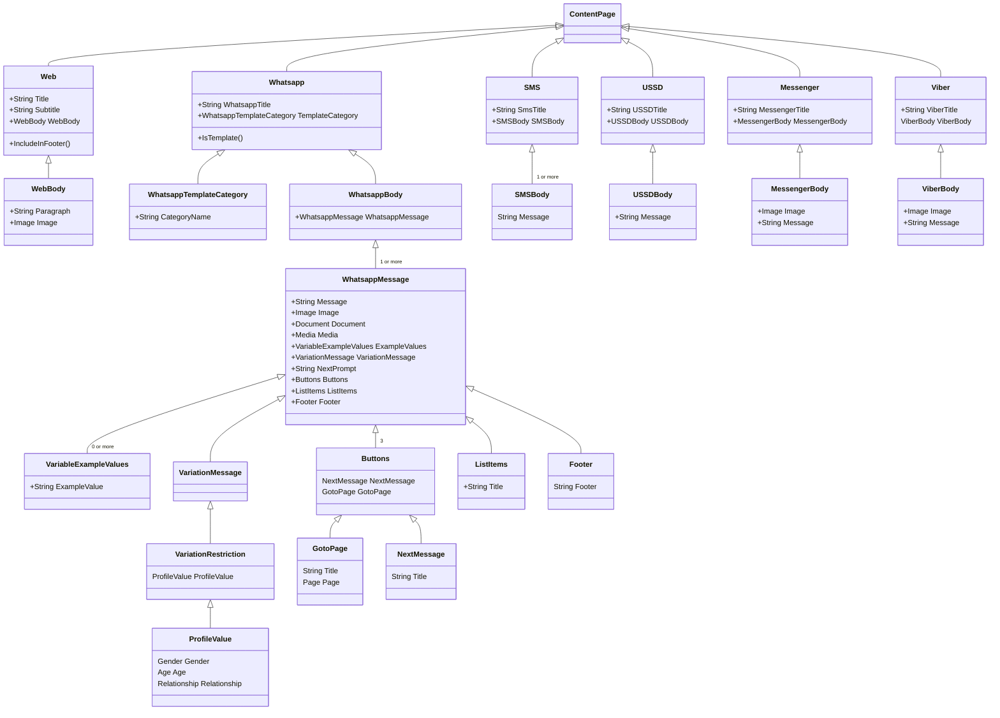
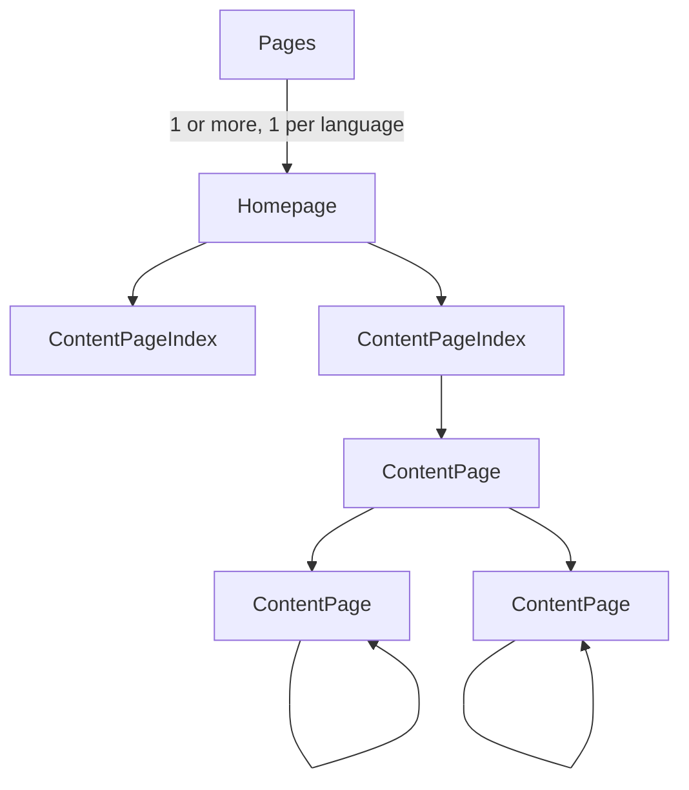

Please view the full [Design Documentation Section](https://sites.google.com/praekelt.org/portfolio-projects/platform/content-repo/design-documentation) on the Portfolio Sites pages for more detail

## High-level Content Structure Diagram

  ```mermaid
graph TD;
      Pages --> Homepage
      Homepage -->ContentPageIndex;
      ContentPageIndex -->ContentPage;
      ContentPage -->Web;
      ContentPage -->WhatsApp;
      ContentPage -->SMS;
      ContentPage -->USSD;
      ContentPage -->Viber;
      ContentPage --> Messenger
```

## ContentPage Class Diagram



## Page Tree Structure

