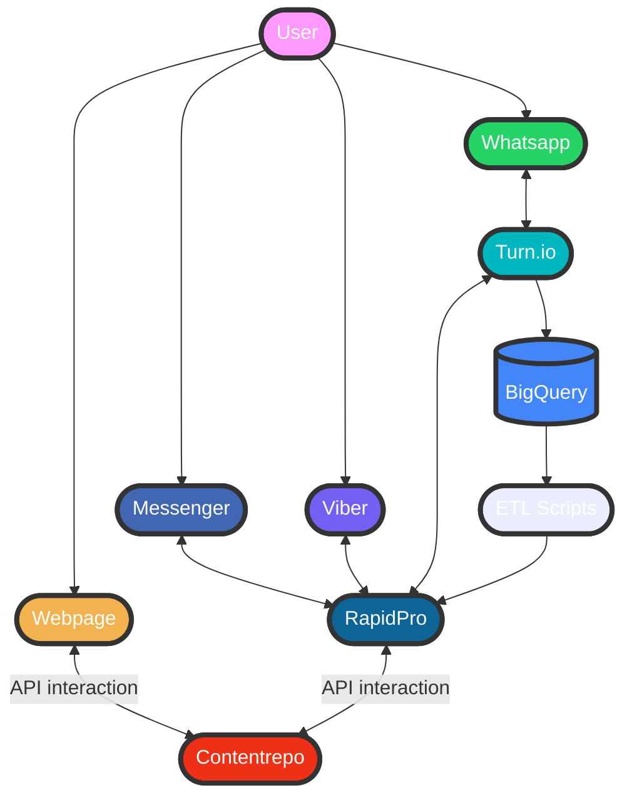

# Infrastructure and Deployment

## Infrastructure

Contentrepo is used to manage all content, without concern for the frontend. RapidPro and/or Turn.io will be needed to manage the flows and user journeys. The Contentrepo content can be accessed via the API.

## Deploy

Contentrepo is deployed using Kubernetes. When a commit on the Contentrepo repo is tagged in Github, an image is pushed to Dockerhub. That Docker image can be used to create a container to run Contentrepo for your project.
